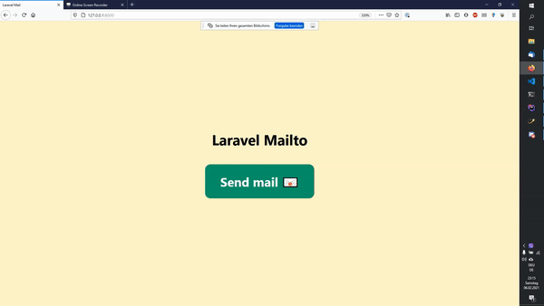

# Laravel-Mailto

[](https://packagist.org/packages/wulfheart/laravel-mailto)
[](https://packagist.org/packages/wulfheart/laravel-mailto)


Laravel-Mailto allows you to generate mailto-links with recipients, cc and bcc, subject and body. If an user clicks the link it opens the default mail editor prefilled with data. This comes in handy if you want your users to have the ability to send emails from their own client. 


## Installation

You can install the package via composer:

```bash
composer require wulfheart/laravel-mailto
```

## Usage

```blade
// some blade file
<a href="{{ 
mailto("jeffrey@example.com")
->cc(["ryan@example.com", "taylor@example.com"])
->bcc("freek@example.com")
->subject("Laravel")
->body("Hello Jeffrey,\n\nthis is a message.\n\nBest,\nAlex") 
}}">
    Send mail 📧
</a>
```

## Result



## Contributing

You are welcome to contribute.

## Credits

- [Alex Wulf](https://github.com/wulfheart)
- [All Contributors](../../contributors)

## License

The MIT License (MIT). Please see [License File](LICENSE.md) for more information.
